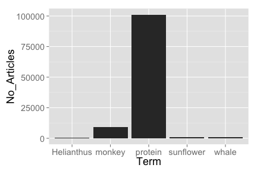
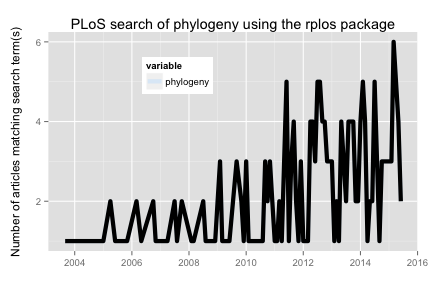

<!--
%\VignetteEngine{knitr::knitr}
%\VignetteIndexEntry{rplos tutorial}
-->

rplos tutorial
=====


The `rplos` package interacts with the API services of [PLoS](http://www.plos.org/) (Public Library of Science) Journals. In order to use `rplos`, you need to obtain [your own key](http://api.plos.org/registration/) to their API services. Instruction for obtaining and installing keys so they load automatically when you launch R are on our GitHub Wiki page [Installation and use of API keys](https://github.com/ropensci/rOpenSci/wiki/Installation-and-use-of-API-keys).

This tutorial will go through three use cases to demonstrate the kinds
of things possible in `rplos`.

* Search across PLoS papers in various sections of papers
* Search for terms and visualize results as a histogram OR as a plot through time
* Text mining of scientific literature

### Load package from CRAN


```r
install.packages("rplos")
```


```r
library('rplos')
```

### Search across PLoS papers in various sections of papers

`searchplos` is a general search, and in this case searches for the term
**Helianthus** and returns the DOI's of matching papers


```r
searchplos(q= "Helianthus", fl= "id", limit = 5)
```

```
#> $meta
#>   numFound start  maxScore
#> 1      296     0 0.4991457
#> 
#> $data
#>                             id
#> 1 10.1371/journal.pone.0111982
#> 2 10.1371/journal.pone.0057533
#> 3 10.1371/journal.pone.0045899
#> 4 10.1371/journal.pone.0037191
#> 5 10.1371/journal.pone.0051360
```

Get only full article DOIs


```r
searchplos(q="*:*", fl='id', fq='doc_type:full', start=0, limit=5)
```

```
#> $meta
#>   numFound start maxScore
#> 1  1188800     0        1
#> 
#> $data
#>                             id
#> 1 10.1371/journal.pone.0057487
#> 2 10.1371/journal.ppat.0030138
#> 3 10.1371/journal.pone.0071347
#> 4 10.1371/journal.pone.0043700
#> 5 10.1371/journal.pone.0015651
```

Get DOIs for only PLoS One articles


```r
searchplos(q="*:*", fl='id', fq='cross_published_journal_key:PLoSONE', start=0, limit=5)
```

```
#> $meta
#>   numFound start maxScore
#> 1  1188800     0        1
#> 
#> $data
#>                                                    id
#> 1           10.1371/journal.pone.0098523/introduction
#> 2           10.1371/journal.pone.0015652/introduction
#> 3 10.1371/journal.pone.0015652/results_and_discussion
#> 4  10.1371/journal.pone.0015652/materials_and_methods
#> 5 10.1371/journal.pone.0098523/results_and_discussion
```

Get DOIs for full article in PLoS One


```r
searchplos(q="*:*", fl='id',
   fq=list('cross_published_journal_key:PLoSONE', 'doc_type:full'),
   start=0, limit=5)
```

```
#> $meta
#>   numFound start maxScore
#> 1  1188800     0        1
#> 
#> $data
#>                             id
#> 1 10.1371/journal.pone.0057487
#> 2 10.1371/journal.pone.0071347
#> 3 10.1371/journal.pone.0043700
#> 4 10.1371/journal.pone.0015651
#> 5 10.1371/journal.pone.0029650
```

Search for many terms


```r
q <- c('ecology','evolution','science')
lapply(q, function(x) searchplos(x, limit=2))
```

```
#> [[1]]
#> [[1]]$meta
#>   numFound start  maxScore
#> 1    24708     0 0.9781508
#> 
#> [[1]]$data
#>                             id
#> 1 10.1371/journal.pone.0059813
#> 2 10.1371/journal.pone.0001248
#> 
#> 
#> [[2]]
#> [[2]]$meta
#>   numFound start  maxScore
#> 1    41781     0 0.8152939
#> 
#> [[2]]$data
#>                                                        id
#> 1 10.1371/annotation/9773af53-a076-4946-a3f1-83914226c10d
#> 2 10.1371/annotation/c55d5089-ba2f-449d-8696-2bc8395978db
#> 
#> 
#> [[3]]
#> [[3]]$meta
#>   numFound start  maxScore
#> 1   120601     0 0.6816086
#> 
#> [[3]]$data
#>                             id
#> 1 10.1371/journal.pbio.0020122
#> 2 10.1371/journal.pbio.1001166
```

### Search on specific sections

A suite of functions were created as light wrappers around `searchplos` as a shorthand to search specific sections of a paper.

* `plosauthor` searchers in authors
* `plosabstract` searches in abstracts
* `plostitle` searches in titles
* `plosfigtabcaps` searches in figure and table captions
* `plossubject` searches in subject areas

`plosauthor` searches across authors, and in this case returns the authors of the matching papers. the fl parameter determines what is returned


```r
plosauthor(q = "Eisen", fl = "author", limit = 5)
```

```
#> $meta
#>   numFound start maxScore
#> 1      741     0 4.189553
#> 
#> $data
#>             author
#> 1 Jonathan A Eisen
#> 2 Jonathan A Eisen
#> 3 Jonathan A Eisen
#> 4 Jonathan A Eisen
#> 5 Jonathan A Eisen
```

`plosabstract` searches across abstracts, and in this case returns the id and title of the matching papers


```r
plosabstract(q = 'drosophila', fl='id,title', limit = 5)
```

```
#> $meta
#>   numFound start maxScore
#> 1     2491     0 2.239879
#> 
#> $data
#>                             id
#> 1 10.1371/journal.pbio.0040198
#> 2 10.1371/journal.pbio.0030246
#> 3 10.1371/journal.pone.0012421
#> 4 10.1371/journal.pone.0002817
#> 5 10.1371/journal.pbio.0030389
#>                                                                             title
#> 1                                                                     All for All
#> 2                                     School Students as Drosophila Experimenters
#> 3                            Host Range and Specificity of the Drosophila C Virus
#> 4 High-Resolution, In Vivo Magnetic Resonance Imaging of Drosophila at 18.8 Tesla
#> 5                     New Environments Set the Stage for Changing Tastes in Mates
```

`plostitle` searches across titles, and in this case returns the title and journal of the matching papers


```r
plostitle(q='drosophila', fl='title,journal', limit=5)
```

```
#> $meta
#>   numFound start maxScore
#> 1     1599     0 3.805348
#> 
#> $data
#>                      journal
#> 1                   PLoS ONE
#> 2                   PLoS ONE
#> 3              PLoS Genetics
#> 4                   PLoS ONE
#> 5 PLoS Computational Biology
#>                                                   title
#> 1              A Tripartite Synapse Model in Drosophila
#> 2           Quantification of Food Intake in Drosophila
#> 3 Phenotypic Plasticity of the Drosophila Transcriptome
#> 4                             A DNA Virus of Drosophila
#> 5            Parametric Alignment of Drosophila Genomes
```

### Faceted search

Facet by journal


```r
facetplos(q='*:*', facet.field='journal')
```

```
#> $facet_queries
#> NULL
#> 
#> $facet_fields
#> $facet_fields$journal
#>                                  X1     X2
#> 1                          plos one 946507
#> 2                     plos genetics  41277
#> 3                    plos pathogens  35950
#> 4        plos computational biology  30312
#> 5                      plos biology  26292
#> 6  plos neglected tropical diseases  25694
#> 7                     plos medicine  18601
#> 8              plos clinical trials    521
#> 9                  plos collections     10
#> 10                     plos medicin      9
#> 
#> 
#> $facet_dates
#> NULL
#> 
#> $facet_ranges
#> NULL
```

Using `facet.query` to get counts


```r
facetplos(q='*:*', facet.field='journal', facet.query='cell,bird')
```

```
#> $facet_queries
#>        term value
#> 1 cell,bird    18
#> 
#> $facet_fields
#> $facet_fields$journal
#>                                  X1     X2
#> 1                          plos one 946507
#> 2                     plos genetics  41277
#> 3                    plos pathogens  35950
#> 4        plos computational biology  30312
#> 5                      plos biology  26292
#> 6  plos neglected tropical diseases  25694
#> 7                     plos medicine  18601
#> 8              plos clinical trials    521
#> 9                  plos collections     10
#> 10                     plos medicin      9
#> 
#> 
#> $facet_dates
#> NULL
#> 
#> $facet_ranges
#> NULL
```

Date faceting


```r
facetplos(q='*:*', url=url, facet.date='publication_date',
  facet.date.start='NOW/DAY-5DAYS', facet.date.end='NOW', facet.date.gap='+1DAY')
```

```
#> $facet_queries
#> NULL
#> 
#> $facet_fields
#> NULL
#> 
#> $facet_dates
#> $facet_dates$publication_date
#>                   date value
#> 1 2014-12-17T00:00:00Z  1712
#> 2 2014-12-18T00:00:00Z  1569
#> 3 2014-12-19T00:00:00Z   536
#> 4 2014-12-20T00:00:00Z     0
#> 5 2014-12-21T00:00:00Z     0
#> 6 2014-12-22T00:00:00Z     0
#> 
#> 
#> $facet_ranges
#> NULL
```

### Highlighted search

Search for the term _alcohol_ in the abstracts of articles, return only 10 results


```r
highplos(q='alcohol', hl.fl = 'abstract', rows=2)
```

```
#> $`10.1371/journal.pmed.0040151`
#> $`10.1371/journal.pmed.0040151`$abstract
#> [1] "Background: <em>Alcohol</em> consumption causes an estimated 4% of the global disease burden, prompting"
#> 
#> 
#> $`10.1371/journal.pone.0027752`
#> $`10.1371/journal.pone.0027752`$abstract
#> [1] "Background: The negative influences of <em>alcohol</em> on TB management with regard to delays in seeking"
```

Search for the term _alcohol_ in the abstracts of articles, and return fragment size of 20 characters, return only 5 results


```r
highplos(q='alcohol', hl.fl='abstract', hl.fragsize=20, rows=2)
```

```
#> $`10.1371/journal.pmed.0040151`
#> $`10.1371/journal.pmed.0040151`$abstract
#> [1] "Background: <em>Alcohol</em>"
#> 
#> 
#> $`10.1371/journal.pone.0027752`
#> $`10.1371/journal.pone.0027752`$abstract
#> [1] " of <em>alcohol</em> on TB management"
```

Search for the term _experiment_ across all sections of an article, return id (DOI) and title fl only, search in full articles only (via `fq='doc_type:full'`), and return only 10 results


```r
highplos(q='everything:"experiment"', fl='id,title', fq='doc_type:full',
   rows=2)
```

```
#> $`10.1371/journal.pone.0039681`
#> $`10.1371/journal.pone.0039681`$everything
#> [1] " Selection of Transcriptomics <em>Experiments</em> Improves Guilt-by-Association Analyses Transcriptomics <em>Experiment</em>"
#> 
#> 
#> $`10.1371/journal.pone.0108803`
#> $`10.1371/journal.pone.0108803`$everything
#> [1] " PONE-D-14-40021  10.1371/journal.pone.0108803  Correction   Correction: Partner <em>Experiences</em>"
```

### Search for terms and visualize results as a histogram OR as a plot through time

`plosword` allows you to search for 1 to K words and visualize the results
as a histogram, comparing number of matching papers for each word


```r
out <- plosword(list("monkey", "Helianthus", "sunflower", "protein", "whale"),
    vis = "TRUE")
out$table
```

```
#>   No_Articles       Term
#> 1        8274     monkey
#> 2         296 Helianthus
#> 3         809  sunflower
#> 4       91291    protein
#> 5        1014      whale
```


```r
out$plot
```

 

You can also pass in curl options, in this case get verbose information on the curl call.


```r
plosword('Helianthus', callopts=list(verbose=TRUE))
```

```
#> Number of articles with search term 
#>                                 296
```

### Visualize terms

`plot_throughtime` allows you to search for up to 2 words and visualize the results as a line plot through time, comparing number of articles matching through time. Visualize with the ggplot2 package, only up to two terms for now.


```r
plot_throughtime(terms = "phylogeny", limit = 200) + geom_line(size=2, color='black')
```

 
